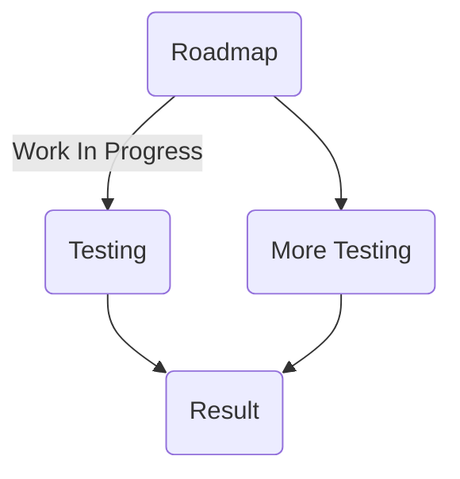

This project has the following goals:
- Replicate the battlefront (2004) game in HTML5/Node/NWjs
- Have minimum compatibility with original game servers
- Emulate game servers (future task) for both versions
- Enable modern modding
- Backend for using original game's file formats (model files, and terrain files)
  NOTE: Original game's assets will not be used, other than for reference for compatibility!

## Development

I develop the project in my free time. I do not get paid for it, and I don't plan to. This software is open source, and built using free tools commonly available on the internet! -- You can develop with me! I'm not super strict, so if you write usable code and submit a PULL REQUEST, I will probably feature your work! Keep code readable, or I'll refactor it myself.
- See developer setup instructions: https://github.com/RepComm/swbf_web_client/wiki

## Regarding assets/code
I can't/won't restrict or otherwise be responsible for modifications (addons of any kind, or project forks) that use assets that don't belong to me/public domain.
- None of the assets in RELEASES will be from the original game.
Debug code will undoubtedly contain original assets for development purposes, but will be removed in any release from master project.
- All textures/models/code is rewritten from scratch, using original game as a reference.
- I am not responsible for forks/clones of this project using assets from places otherwise illegal, or unproper.
- All of my own work for this project is public domain (everything in a release should be safe to reuse at your discretion). Please have fun repurposing whatever you wish with no charge/guilt! I don't care if it's commercial or not, make the world a better place!

##Working on integrating discord channel and my website to make this project more mature. Should be rolling out in a week or two!

### Roadmap (work in progress)

Uses https://mermaidjs.github.io/

Hopefully it will look something like this:

